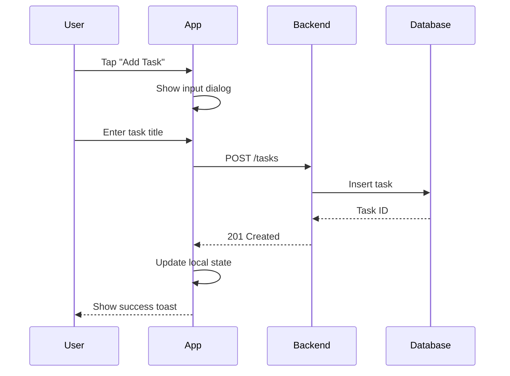
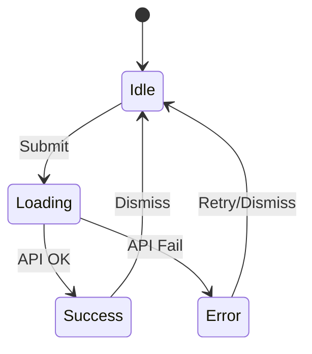
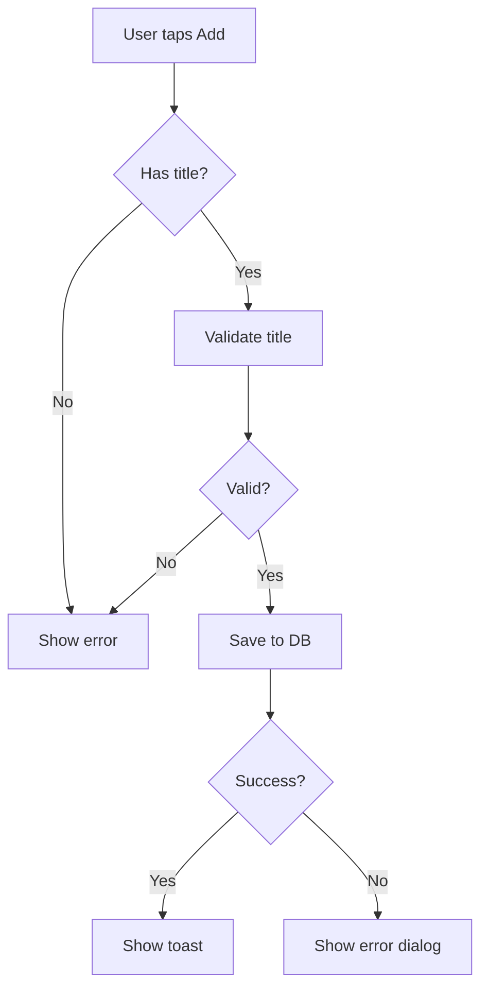

# Flow Audit Skill

## Purpose

Trace user paths step-by-step to find:
- Dead ends (where users get stuck)
- Logic loops (infinite or unclear states)
- Race conditions (async timing issues)
- Missing error handlers
- Incomplete state transitions

## Flow Audit Checklist

Copy and track your audit:

```
Flow Audit Progress:
- [ ] Entry point identified
- [ ] Happy path traced end-to-end
- [ ] Error states handled at each step
- [ ] Loading states present
- [ ] Back navigation works correctly
- [ ] Edge cases considered
- [ ] State cleanup on exit
```

## Step-by-Step Analysis

### 1. Identify Entry Point

Where does the user start?
- Button click
- Navigation event
- Deep link
- Notification tap

### 2. Trace Happy Path

For each step, document:
- **User action**: What did user do?
- **System response**: What happens immediately?
- **Async operations**: What happens in background?
- **Next state**: Where does user end up?

### 3. Check Error Branches

At each async step:
- What if network fails?
- What if data is invalid?
- What if user cancels?
- What if permission denied?

### 4. Verify State Transitions

```
State A → Action → State B
         ↳ Error → State E
         ↳ Cancel → State A (cleanup?)
```

## Mermaid Diagram Generation

After tracing a flow, generate a diagram:

### Sequence Diagram (API Calls)



### State Diagram (UI States)



### Flowchart (Decision Logic)



## Common Flow Patterns

### Task Creation Flow

```
1. User taps "+" button
2. Sheet opens with empty form
3. User enters title
4. User taps "Save"
5. App validates input
6. App saves to local DB
7. App syncs to server (if online)
8. Sheet closes
9. List refreshes with new task
10. Success toast shown
```

**Error branches:**
- Empty title → Show inline error
- Save fails → Show error dialog, keep sheet open
- Sync fails → Save locally, queue for retry

### Authentication Flow

```
1. App launches
2. Check for existing session
3a. Session valid → Go to home
3b. Session expired → Show login
4. User enters credentials
5. Validate locally
6. Send to server
7. Receive token
8. Store token securely
9. Navigate to home
```

**Error branches:**
- Invalid credentials → Show error, stay on login
- Network error → Offer offline mode or retry
- Token expired during use → Redirect to login

## Race Condition Checklist

Look for these patterns:

| Pattern | Risk | Solution |
|---------|------|----------|
| Multiple rapid taps | Duplicate submissions | Debounce, disable button |
| Back during async | Orphaned operations | Cancel on dispose |
| Config change during load | Lost state | ViewModel + SavedStateHandle |
| Concurrent writes | Data corruption | Mutex or single-writer |

## Output Format

When reporting a flow audit, provide:

1. **Flow name**: What user journey this covers
2. **Entry point**: Where it starts
3. **Happy path**: Numbered steps
4. **Error branches**: What can go wrong at each step
5. **Diagram**: Mermaid sequence or state diagram
6. **Issues found**: Dead ends, missing handlers, race conditions
7. **Recommendations**: How to fix issues

## Example Audit Output

### Task Completion Flow Audit

**Entry**: User taps checkbox on task card

**Happy Path**:
1. User taps checkbox
2. Checkbox animates to checked
3. Task marked complete in local DB
4. Momentum gauge updates
5. If streak milestone → Show achievement
6. Sync to server (background)

**Error Branches**:
- Step 3 fails: Revert checkbox, show toast
- Step 6 fails: Queue for retry, no user impact

**Issues Found**:
- ⚠️ No loading indicator during save
- ⚠️ Rapid double-tap can trigger twice
- ✅ Error handling present

**Recommendations**:
1. Add debounce to checkbox tap
2. Consider optimistic UI update with rollback

## Related Skills

| When | Use |
|------|-----|
| Designing new flows | `/brainstorming` for requirements |
| Planning implementation | `/planning-features` for task breakdown |
| Found a bug in flow | `/systematic-debugging` for root cause |
| Race condition found | `/tdd-android` to write regression test |
