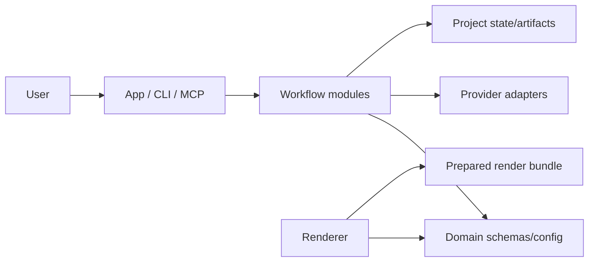
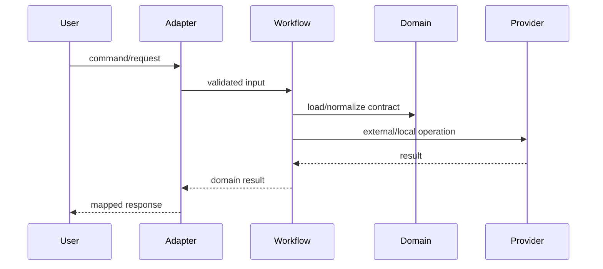

# Architecture And Agent Pattern Inventory

Use this reference to classify a codebase before diagramming it. Prefer direct source markers over README descriptions.

## Inventory Checklist

- Entrypoints: HTTP servers, CLIs, MCP servers, workers, UI bootstraps, renderers.
- Adapters: routes, commands, tools, button handlers, webhooks, provider clients.
- Workflows: named orchestration modules, job runners, queues, pipelines, state machines.
- Domain: schemas, validators, canonical models, normalization, policy/config maps.
- Providers: LLM, TTS, image, storage, database, browser, file system, render services.
- State: local files, database tables, caches, run state, generated artifacts, checkpoints.
- Async behavior: job lifecycle, polling, fan-out/fan-in, cancellation, stale result handling.
- Failure behavior: retries, fallbacks, warnings, validation gates, recovery paths.
- Sensors: tests, lint, typecheck, boundary scripts, CI, smoke/render checks.

## Relationship Classification

- Explicit: direct imports, function calls, route bindings, schema references, config reads, documented command wiring in source.
- Inferred: implied by naming, workspace responsibility, scripts, or framework conventions but not directly traced in the files read.
- Unknown: referenced service/component without source or contract in the analyzed scope.

Represent inferred relationships with dashed edges where the Mermaid diagram type supports it. Put unknowns in an "External / Unknown" group or label them with `?`.

## Common Patterns

- Thin adapter plus workflow: entrypoint validates/maps, then delegates to named command or runner.
- Provider adapter: workflow calls an interface, concrete providers handle external APIs or local services.
- Canonical schema: Zod/Pydantic/JSON schema owns the contract; adapters and renderers import derived types.
- Generated artifact pipeline: source data becomes normalized plan, then render bundle, then media/output.
- Local-first studio: browser UI calls local server, server writes local project state and job history.
- MCP control surface: MCP tools call the same project/workflow modules as CLI or server adapters.
- Renderer boundary: render-time app consumes a prepared bundle and does not own orchestration.

## Diagram Templates

### Monorepo System Architecture

### Request Lifecycle

