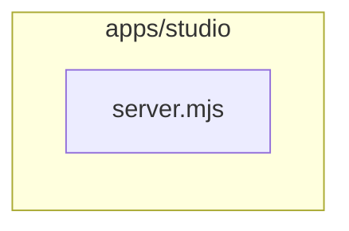

# Mermaid Syntax Guard

Use this before finalizing Mermaid, especially for diagrams intended for GitHub Markdown.

## General Rules

- Put `%%{init: ...}%%` before the diagram declaration if used.
- Prefer quoted labels: `nodeId["Human label"]`.
- Keep node IDs simple: letters, digits, underscores. Avoid spaces, hyphens, slashes, dots, and parentheses in IDs.
- Escape or avoid label characters that often break rendering: raw quotes, angle brackets, pipes, braces, and Markdown links.
- Keep HTML out of labels unless the target renderer explicitly supports it.
- Prefer `flowchart LR` or `flowchart TD`; avoid experimental syntax for docs that must render everywhere.
- Do not overuse edge labels. If labels become long, move the detail to notes below the diagram.
- Split diagrams when there are more than roughly 15-20 nodes or the graph crosses multiple concerns.
- Treat crossing edges as a design smell for onboarding docs. If a central cluster has edges entering from both sides, split the view by dependency direction, lifecycle phase, or audience question.

## Flowchart Rules

- Define subgraphs with quoted names when needed:

- Keep edge styles simple:
  - Solid: `A --> B` for explicit source-backed relationships.
  - Dashed: `A -. inferred .-> B` for inferred relationships.
  - Open: `A --- B` for association without direction.

- Define `classDef` blocks after nodes and edges.
- Apply classes after definitions: `class a,b adapter;`.

## Sequence Rules

- Declare all participants before messages.
- Balance activations/deactivations if using `activate`; skip activation markers if the flow is already clear.
- Use `alt`, `opt`, and `par` sparingly and close each block with `end`.
- Keep messages short and put implementation details below the diagram.

## Self-Repair Pass

1. Remove complex styling and confirm the plain diagram is valid.
2. Quote every label.
3. Rename risky node IDs to simple identifiers.
4. Replace complex edge labels with short verbs.
5. Split subgraphs or secondary flows if the parser error points near a dense block.
6. Re-add styling only after syntax is stable.
