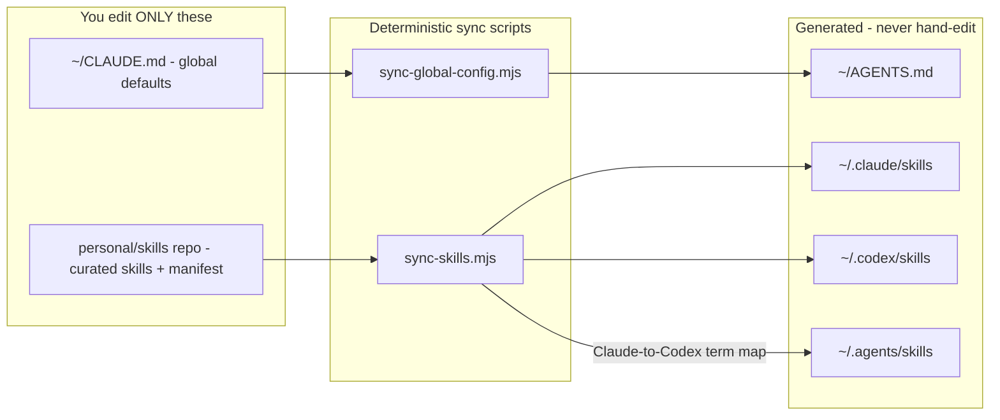
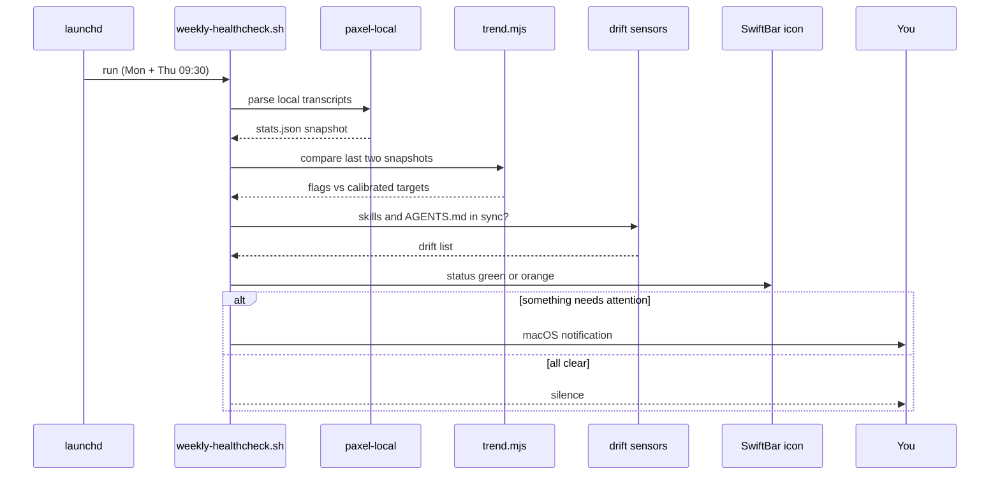
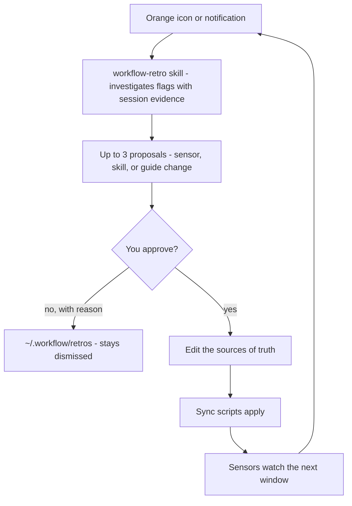

# User-Wide Workflow Architecture

Generated: 2026-06-10
Scope: personal/skills sync + reflection infrastructure, plus the machine-local automation it drives
Evidence: skills.manifest.json, scripts/sync-skills.mjs, scripts/sync-global-config.mjs, scripts/validate-skills.sh, scripts/reflect/weekly-healthcheck.sh, scripts/reflect/trend.mjs, scripts/reflect/swiftbar-workflow-health.1d.sh, codex/workflow-retro/SKILL.md, ~/Library/LaunchAgents/com.richardlitang.workflow-healthcheck.plist

## View 1: Where things live — you edit two places, everything else is generated

`validate-skills.sh` runs both sync scripts in `--check` mode: if a generated file
drifts from its source, the validator fails and the weekly healthcheck notifies.
Sync never deletes; unknown files are reported, not removed.

## View 2: What happens Monday and Thursday 09:30 — fully automatic, zero LLM, zero network

Metrics watched (calibrated to the 2026-06-10 baseline): test runs per 100 tool
calls (min 1.5), error rate (max 2), new hammered files (max 0), error recovery
(min 0.7), planning ratio (min 0.6). All data stays in `~/.workflow/`, private.

## View 3: How the workflow improves itself — LLM and human enter only here

## Notes

- Explicit: every edge above is backed by code written and tested 2026-06-10
  (sync engine 9 tests, global-config 2 tests, trend 4 tests; launchd job loaded
  and verified; SwiftBar plugin symlinked and output-tested).
- Inferred: none.
- Unknown/external: paxel-local internals are upstream code (read, not owned);
  its codex-source error counting is known to undercount (string outputs carry
  no success flag), so error metrics bind mainly on claude-source windows.
- Out of scope: personal/agents (blindspot) runs its own product-internal
  harness-learning loop mirroring the same propose-then-approve pattern.
